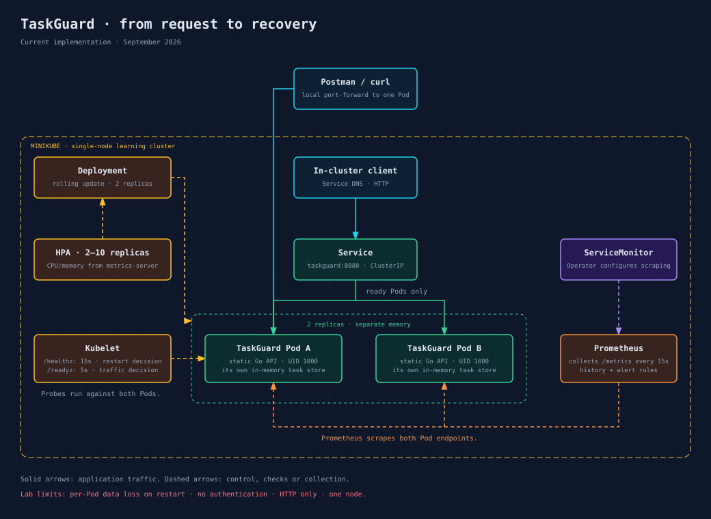

# TaskGuard

[](https://github.com/bnasif25/taskguard/actions/workflows/ci.yml)

TaskGuard is a small Go task API productionised for a Kubernetes learning and operations demonstration. The application is deliberately simple so the repository can focus on reproducible deployment, least privilege, reliability, observability, testing, and failure recovery.

> The task store is in memory. Data is intentionally lost when a Pod restarts, and two replicas do not share tasks. This is a documented demonstration limitation, not a production data design.

## Architecture



[Download the PNG](diagram/taskguard/architecture@2x.png)

```text
In-cluster client
      |
Kubernetes Service
      |
two ready TaskGuard Pods ----> JSON logs
      |
   /metrics <---- Prometheus <---- ServiceMonitor
                         |
                    alert rules
```

Local Postman access uses a temporary `kubectl port-forward` tunnel to one selected Pod.

The Service sends traffic only to Pods that pass `/readyz`. Kubernetes restarts a container when `/healthz` repeatedly fails. Prometheus discovers the Service through the `ServiceMonitor` and scrapes `/metrics` every 15 seconds.

## Proven environment

The documented target is a local Minikube cluster using Docker Desktop. It was verified on an Apple Silicon Mac, and the pinned container images are multi-architecture.

The final workflow passed a fresh-cluster rehearsal and full API smoke check;
see [TEST-REPORT.md](TEST-REPORT.md) for the successful run and the failures
that led to the final design.

| Component | Verified or pinned version |
|---|---:|
| Go toolchain and builder | 1.26.8 |
| Docker Desktop engine | 29.6.2 |
| Minikube | 1.38.1 |
| Kubernetes server | 1.35.1 |
| kubectl client | 1.36.3 |
| Helm | 4.2.4 |
| kube-prometheus-stack | 88.6.1 |
| Kubeconform in CI | 0.8.0 |
| Trivy in local checks | 0.74.0 |

Newer compatible patch versions may work, but the table records the environment actually tested.

## Prerequisites

Install and start:

- Docker Desktop
- Go
- `kubectl`
- Minikube
- Helm
- GNU Make and `curl` (already available on most macOS/Linux systems)

No cloud account or paid service is required. The first deployment downloads the Minikube node image and the monitoring chart, so it takes longer than later deployments.
New profiles receive 2 CPUs and 3 GiB RAM by default. Keep at least 4 GiB available
to Docker for a dedicated run; this workstation uses an 8 GiB Docker VM.

## Reproduce the deployment

Clone the public repository and run the single deployment entry point:

```bash
git clone https://github.com/bnasif25/taskguard.git
cd taskguard
make deploy
```

`make deploy` performs these idempotent steps:

1. Checks the required command-line tools and Docker Desktop.
2. Starts a Docker-driver Minikube cluster at Kubernetes `v1.35.1` if necessary.
3. Enables the Minikube `metrics-server` add-on.
4. Installs kube-prometheus-stack `88.6.1` and waits for its CRDs.
5. Builds `taskguard:1.0.0` directly inside Minikube, matching either ARM64 or AMD64.
6. Applies every resource through Kustomize.
7. Restarts the Deployment to refresh ConfigMap environment values.
8. Waits until the rollout succeeds.

No manual image loading, namespace creation, or Prometheus CRD installation is required.
The default exposure is a ClusterIP Service plus local port-forwarding. An Ingress
controller is not required. The former ingress-nginx dependency was removed
because it is [retired](https://kubernetes.io/blog/2025/11/11/ingress-nginx-retirement/).
A production edge would need a maintained Gateway/Ingress implementation, TLS and authentication.
The automation explicitly targets the `minikube` context. To use a separate
profile, pass `MINIKUBE_PROFILE=taskguard-rehearsal` to every Make command.

## Verify the running application

Run the automated smoke check:

```bash
make verify
```

It verifies that the Deployment is available, at least two Service endpoints are ready, the probes respond, the task API works, and application metrics are exposed.

To explore it manually with Postman, keep this command running:

```bash
kubectl port-forward -n taskguard service/taskguard 8080:8080
```

Then use `http://localhost:8080`:

| Method | Path | Expected result |
|---|---|---|
| `GET` | `/healthz` | `200`, process is alive |
| `GET` | `/readyz` | `200`, Pod accepts traffic |
| `POST` | `/readyz/disable` | Marks the selected Pod not ready |
| `POST` | `/readyz/enable` | Marks the selected Pod ready |
| `GET` | `/metrics` | Prometheus-format metrics |
| `GET` | `/tasks` | List tasks |
| `POST` | `/tasks` | Create a task from `{"title":"Learn Kubernetes"}` |
| `PUT` | `/tasks/{id}/toggle` | Toggle a task |
| `DELETE` | `/tasks/{id}` | Delete a task; returns `204` |

Because the store is per-Pod, ordinary Service traffic can reach different stores.
A `kubectl port-forward service/...` tunnel selects one Pod for the lifetime of
that tunnel, which makes a complete CRUD demonstration consistent. Reconnecting
may select a different Pod. The Go tests and smoke check both exercise full CRUD.

## Observe metrics and logs

Application logs:

```bash
kubectl logs -n taskguard deployment/taskguard --tail=50
```

Open Prometheus locally:

```bash
kubectl port-forward -n monitoring service/prometheus-kube-prometheus-prometheus 9090:9090
```

Visit `http://localhost:9090/targets` first and confirm both TaskGuard targets are up. Useful PromQL queries include:

```promql
up{job="taskguard"}
sum(rate(taskguard_http_requests_total[5m]))
taskguard_tasks_active
histogram_quantile(0.95, sum by (le) (rate(taskguard_http_request_duration_seconds_bucket[5m])))
```

The observability model, alerts, SLIs and SLOs are documented in [SLO.md](SLO.md).

## Test, validate, and scan

```bash
make test       # race detector plus Go tests and coverage
make lint       # formatting, go vet, and Kustomize rendering
make validate   # Kubernetes 1.35 schema checks with Kubeconform
make security   # Trivy source/configuration and image scans
make container-test # hardened container startup and clean SIGTERM exit
```

GitHub Actions runs the same categories on every push and pull request. The CI checks formatting, static analysis, tests, manifest rendering/validation, a container build, secret detection, misconfiguration scanning, dependency vulnerabilities, and image vulnerabilities.

## Failure and rollback demonstration

```bash
make failure-test
```

The script deploys a deliberately nonexistent image. `maxUnavailable: 0` keeps the two existing healthy replicas serving while the new Pod fails. The script records the failure state, rolls the Deployment back, waits for recovery, and has an exit trap that attempts rollback if the exercise is interrupted.

See [TEST-REPORT.md](TEST-REPORT.md) for observed evidence and [RUNBOOK.md](RUNBOOK.md) for manual diagnosis and recovery commands.

## Teardown

Remove only TaskGuard while keeping Minikube and monitoring:

```bash
make clean
```

Delete the entire dedicated Minikube profile, including monitoring:

```bash
make destroy
```

`make destroy` is intentionally separate because it removes the entire local cluster.

## Kubernetes design

- **Deployment:** two replicas, rolling updates, graceful termination and soft node spreading.
- **Service:** stable internal address and ready-Pod load balancing.
- **Probes:** startup protects slow starts, readiness controls traffic, and liveness controls restarts.
- **Resources:** CPU/memory requests make scheduling and HPA calculations meaningful; limits bound consumption.
- **HPA:** scales from 2 to 10 replicas at 70% CPU or 80% memory utilization relative to requests.
- **PDB:** preserves at least one Pod during voluntary disruptions.
- **Security:** Restricted Pod Security Standards, non-root UID 1000, default seccomp, no privilege escalation, all capabilities dropped, read-only root filesystem, no API token mount, and no RBAC grants.
- **NetworkPolicy:** allows monitoring and same-namespace traffic. Enforcement depends on the cluster CNI; the default local Minikube setup may not enforce it.
- **Configuration:** non-sensitive values come from a ConfigMap. The app currently needs no secret, so it does not inject a fake one.
- **Observability:** structured JSON logs, application metrics, ServiceMonitor and Prometheus alert rules.

## Security and operational evidence

- [Threat model](THREAT-MODEL.md)
- [Security decisions and limitations](SECURITY.md)
- [Operational runbook](RUNBOOK.md)
- [SLIs and SLOs](SLO.md)
- [Test and verification report](TEST-REPORT.md)
- [Learning retrospective](RETROSPECTIVE.md)
- [AI usage disclosure](AI-USAGE.md)
- [Demonstration script](DEMO.md)

## Repository structure

```text
.
├── .github/                 CI and dependency updates
├── scripts/                 smoke and failure tests
├── k8s/                     Kubernetes resources and Kustomize entry point
├── main.go                  application
├── main_test.go             automated API tests
├── Dockerfile               pinned multi-stage image build
├── Makefile                 project entry points
├── diagram/taskguard/       verified architecture SVG and PNG
└── documentation files
```

## Responsible AI use

AI tools were used during initial generation, learning, troubleshooting, review, testing, and submission preparation. The author remains responsible for the project and must explain or modify it during the live assessment. [AI-USAGE.md](AI-USAGE.md) records the tools, prompt categories, rejected recommendations, discovered errors, and verification performed.

## Licence

TaskGuard is available under the [MIT License](LICENSE).
